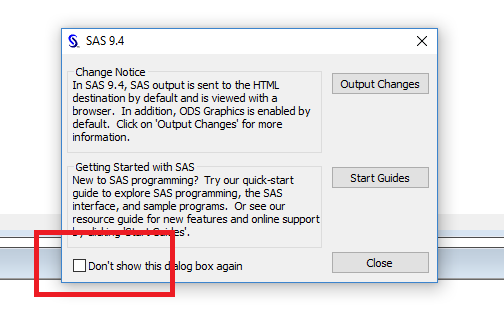
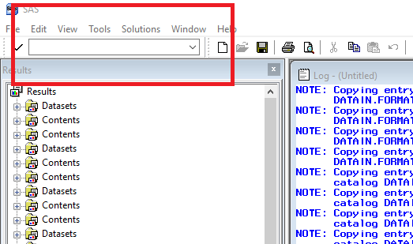

# Description of this AutoHotKey script
This script utilizes AutoHotKey (hence only working on Windows) to send command to SAS program. Sublime package [sas](https://github.com/rpardee/sas) is good for SAS hightlighting and batch submit (build). This script can be used to interactively debug you SAS program before submitting in batch.

# Installation
## Install AutoHotKey on your PC
* Download and install AutoHotKey
## Install the AutoHotkey script
* Copy the AutoHotKey script to a safe location on your computer (such as ```Documents``` folder)
* Double click the file SublimetoSAS.ahk to run it
* To run SublimetoSAS.ahk automatically everytime you boot your computer
    - Copy SublimetoSAS.ahk
    - Press ```windows key + R```
    - Type in ```shell:startup```
    - Press ```Enter```
    - Right click and select ```Paste shortcut```

## Setup on SAS
* If you open SAS and see the message below, please select "Don't show this dialog box again"

* Go the SAS command box (shown as the picture below)



* Type ```keys``` and press ```Enter```
* Change the definition of Key as follows

| Key | Definition |
|---|---|
| F1 | gsubmit buf = default|
| F5 | wpgm|
| F6 | log|
| F7 | output|
| F12 | clear log; clear output; odsresults; clear;|


# Usage
## Note:
* The following shortcuts are only working in .sas files opened in Sublime program
* Please make sure the shortcuts are not being used by other programs

## ```Ctrl+Alt+S```
* Start SAS in the containing location. For example, if you press the above shortcut in ```D:\projects\test.sas```, then a SAS instance will open with the working directory set to be ```D:\projects\```.
* The shortcut should also close SAS enhanced editor. If that's not the case, please close SAS enhanced editor manually.

## ```F3```
* Send the copied word, line, or lines of sas command to SAS and execute.

## ```F12```
* Clear the SAS outputs and results window.


